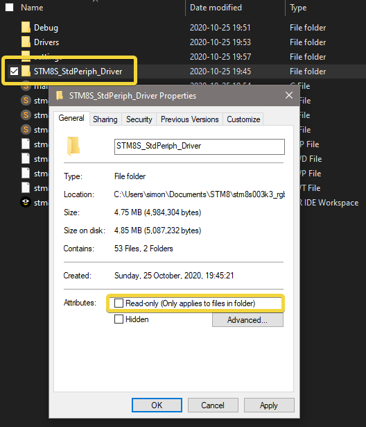
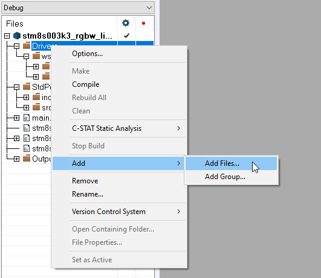
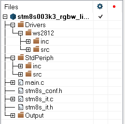
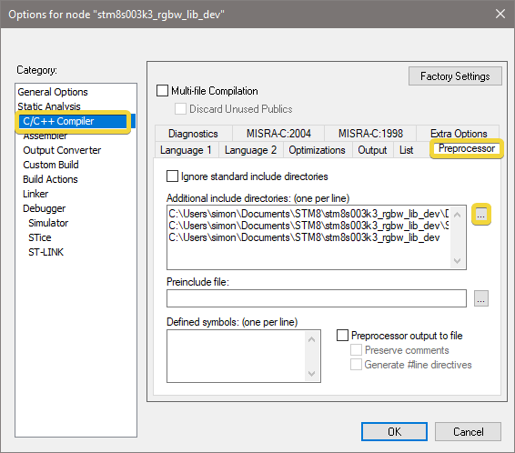
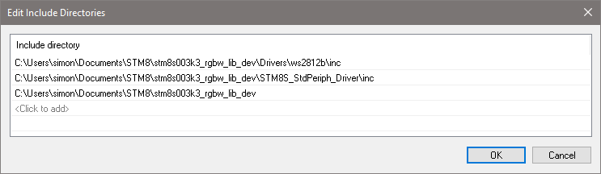
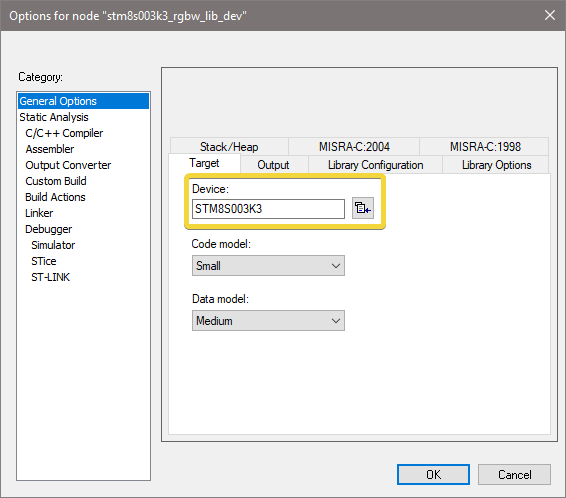
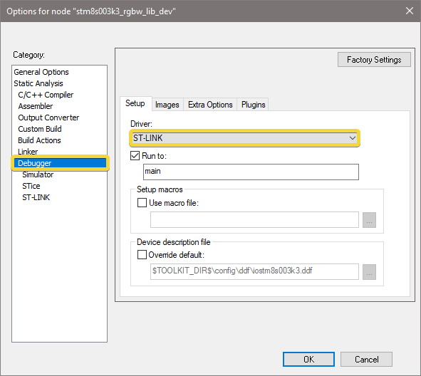
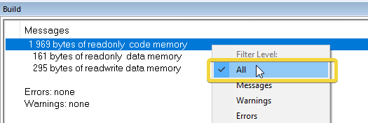

# STM8 Projekt with IAR

---

#### IDE

- Download: [IAR Embedded Workbench ](https://www.iar.com/iar-embedded-workbench/#!?architecture=STM8)
- User Guides: [IAR Embedded Workbench for STM8](https://www.iar.com/support/user-guides/user-guides-iar-embedded-workbench-for-stmicroelectronics-stm8/)

#### Standard Peripheral Libraries

- [STSW-STM8016](https://www.st.com/en/embedded-software/stsw-stm8016.html) for STM8L15x/16x/05x/AL3Lx/AL31x
- [STSW-STM8069](https://www.st.com/en/embedded-software/stsw-stm8069.html) for STM8S/A

Libraries also contain templates and example code.

---

## Start a new Project

`File` > `New Workspace`
`Project` > `Create New Project`

- Toolchain: `STM8`
- Project Templates: `C`

- Save As: browse for a project location (create a new folder for the project)

---

## Add Files to Project

- Create a Folder `Drivers` for any libraries that you want to include later
- Add your libraries to the `Drivers` folder
- Copy the `StdPeriph_Lib` folder to the project folder
- then remove the write protection in the properties:

- inside IAR: right click on the project and add the following Groups and Files:

- right click on the `src` and `inc` Groups and add the corresponding Files from your project folder
> **Important** not every MCU supports all the peripherals!
> only add the peripheral drivers that are supported or required.
> You can also add all the files. Later during compilation you will get errors like: `Error: TIM3 is undefined` and then you know, that your MCU does not support this peripheral and you can remove it from the Group.

- also add the `stm8s_conf.h` / `stm8_it.c` from a template or examaple

---

## Project Settings

- Open `Project` > `⚙️ Options...`
- Add the include paths of all your peripheral libraries:

- select the correct MCU:

- select ST-Link as the debugger:

---

## Code

- use a template, example or tutorial to get started with programming in `main.c`
- uncomment your MCU type in `stm8s_conf.h`

---

## Compile and Upload

- press `F7` or click on the `make` button at the top
- click on: `Project` > `Download` > `download active program` to upload it to your board

In order to show the code size, right click into the Build panel and display "All" messages

